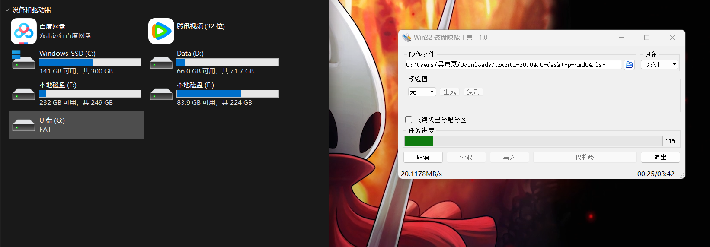
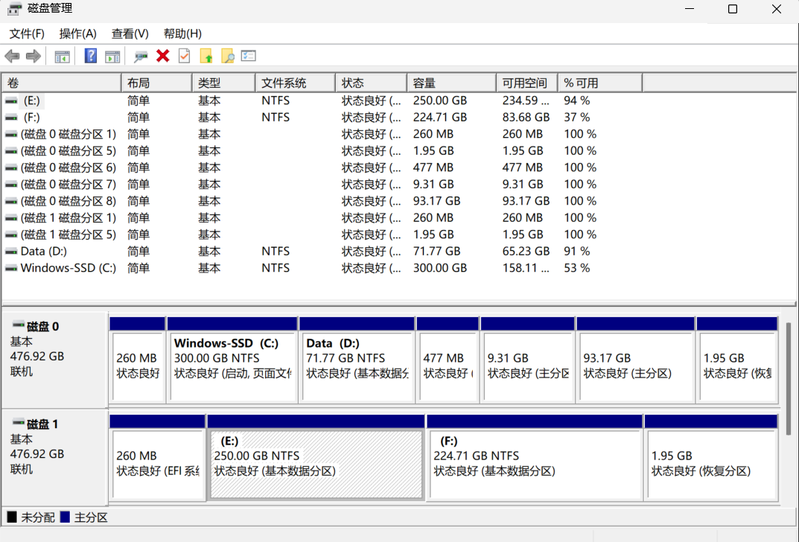
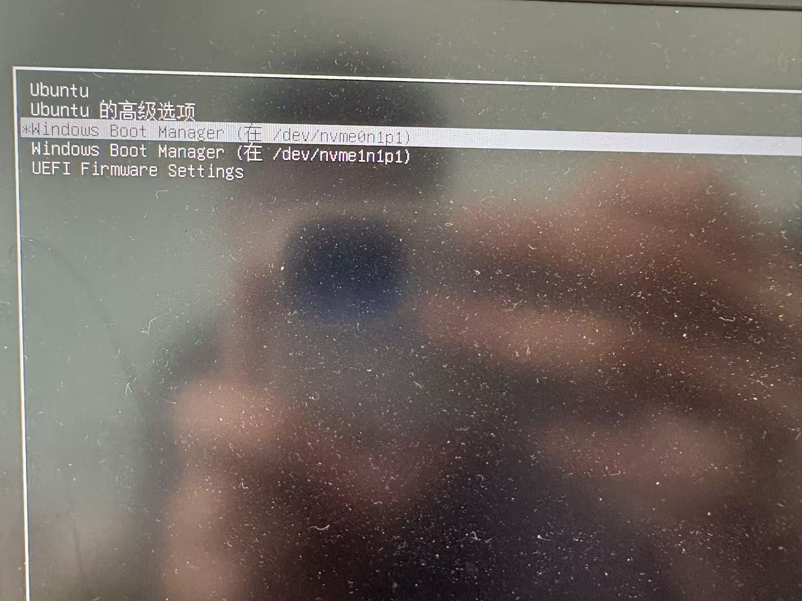
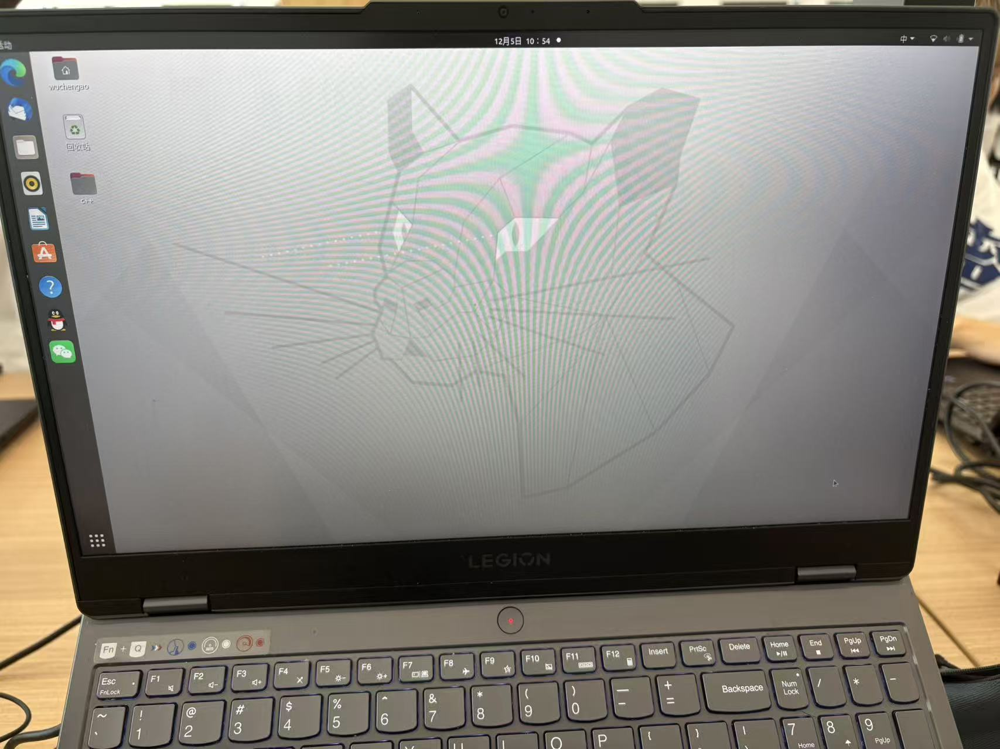
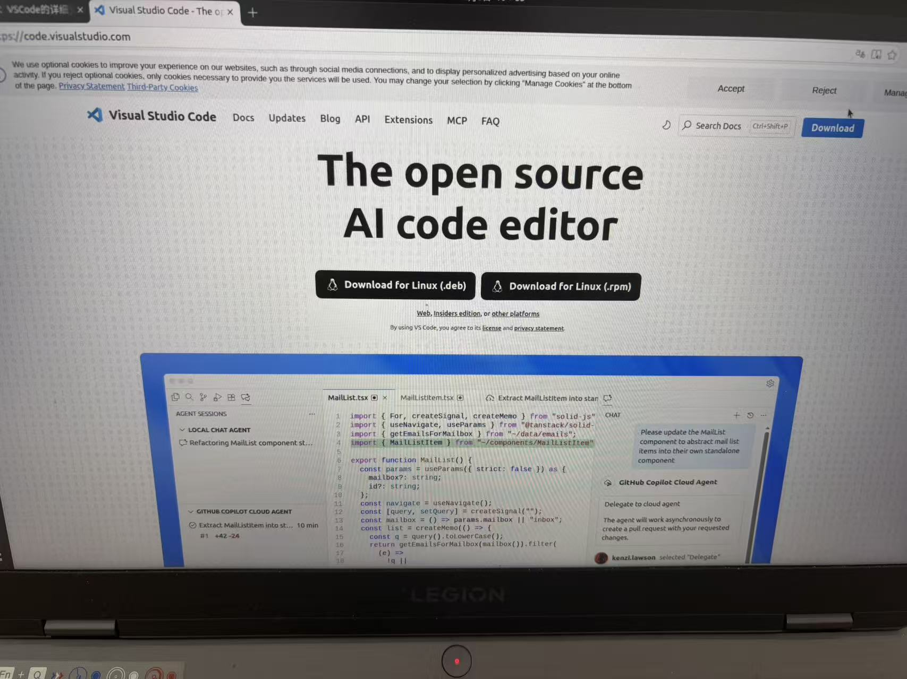
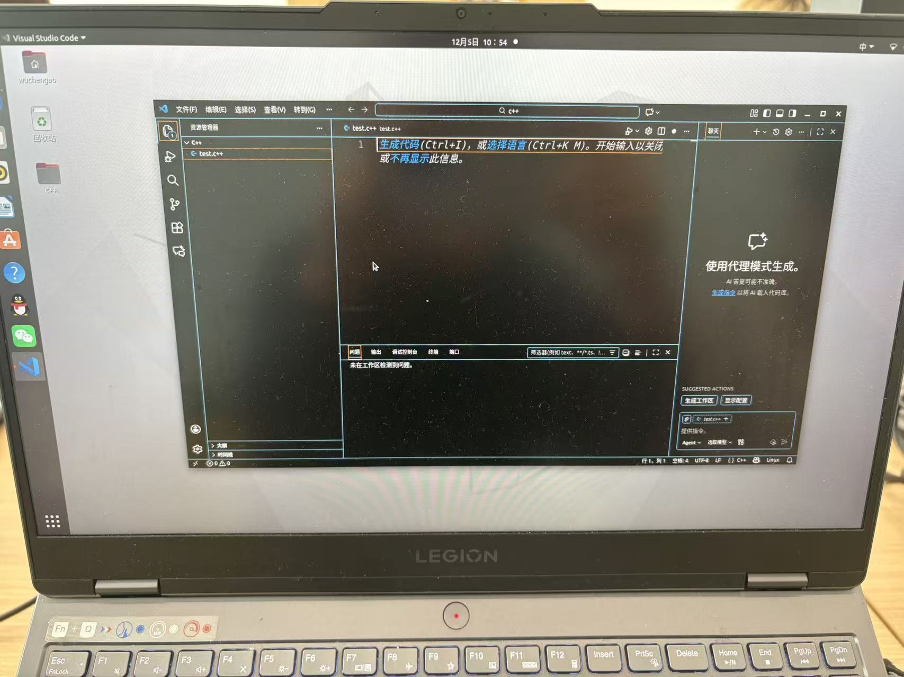
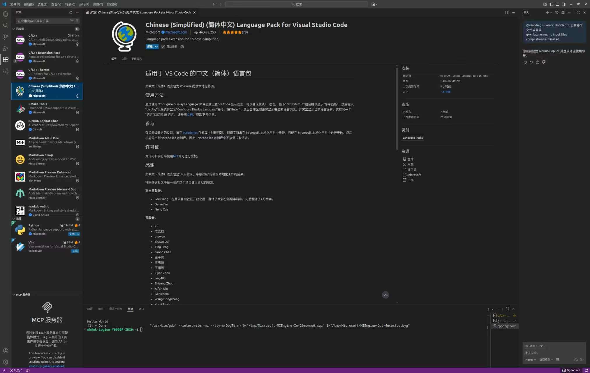
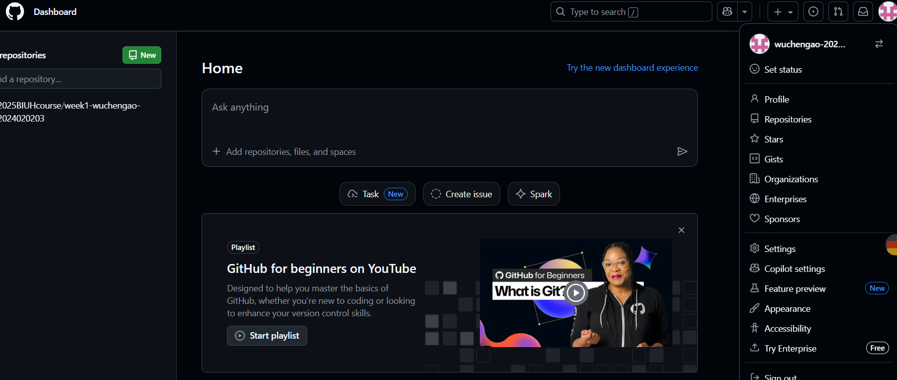
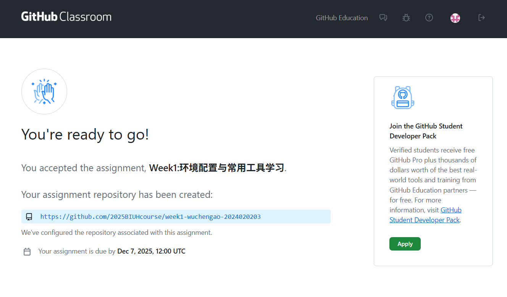

# **Week1.实验报告**
## 1.实验任务
- [x] 安装双系统
- [x] VSCode的安装与配置
- [ ] 完成Git学习与作业
- [x] 编写Markdown实验报告
***
## 2.实现过程
1. *安装Ubuntu系统*
   1. 先在提供的链接里下载Ubuntu镜像文件并且利用U盘制作系统启动盘
        
   2. 查看本电脑磁盘空间并预留空闲磁盘空间
        
   3. 借助Ubuntu启动盘安装Ubuntu系统
      
      
2. *VSCode的安装*
   1. 在官网下载VSCode的LINUX版本
      
   2. 安装并启动VSCode
      
   3. 下载C++必要插件
       
   4. 测试并编写HELLLOWORLD程序
      
3. *Git学习与作业*
   1. 注册GitHub账号并加入组
      
      
   2. 下载Git_bash并建立库
       **未完成**
   3. 完成Git命令学习
   4. 提交作业于对应库
4. *编写Makdown文件提交实验过程*
***
## 3.遇到问题与解决办法
   1. 安装Ubuntu系统时，BIOS设置一直出现无法调整启动·顺序，后面关闭安全模式解决该问题
   2. 无法安装Ubuntu扩展，后续利用终端成功下载
   3. VSCode无法正常编译c++，下载相关编译器以及G++语言成功解决
   4. Git设置本地克隆库出错，暂时没解决办法，尝试解决密钥乱码问题
***  
## 4.总结与心得
   1. 独立成功安装新系统，为以后安装其他系统提供经验
   2. 学习VSCode相关知识，利用插件用于解决其他方面问题
   3. 初次使用Github出现困难，作为新手准备了解更多相关技术技巧